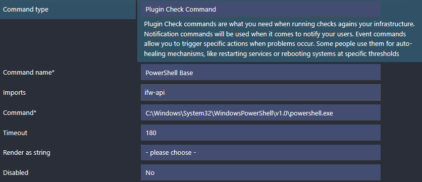

# API Check Forwarder

With Icinga for Windows v1.6.0 we introduced a new feature, allowing to forward executed checks to an internal REST-Api. This will move the check execution from the current PowerShell scope to an internal REST-Api daemon and endpoint and run the command with all provided arguments there.

This will reduce the performance impact on the CPU as well as lower the loading time of the Icinga PowerShell Framework, as only very basic core functionality is required for this.

## Requirements

To use this feature, you wil require the following

* Icinga Agent certificate installed
* Icinga for Windows v1.6.0 or later installed
* [Icinga for Windows Service installed](05-Background-Daemons.md)
* Icinga for Windows v1.4.0+ CheckCommand configuration applied (**Important:** Update your entire Windows environment to v1.4.0+ before updating the Icinga configuration!)

## Installation with IMC

In order to install the REST-Api feature, you can simply enable it by using the IMC. On new installations with the IMC, the feature is enabled by default.

* At first, run `icinga` in your PowerShell to open the IMC
* Navigate to `Settings`
* Navigate to `Icinga for Windows Features`
* Toggle the setting `Api-Check Forwarder` by using the menu index entry (besides the feature is mentioned if it is `Enabled` or `Disabled`)

Please note that you will require to have the [Icinga for Windows Service](05-Background-Daemons.md) already installed. The menu entry will only ensure, that the entire configuration is made and that check commands are enabled as commands.

## Manual Installation and Configuration

### Install Icinga for Windows Service

To make this entire construct work, we will require to install the Icinga for Windows service. You can read more about this on the [background daemon page](05-Background-Daemons.md).

### Register Background Daemon

To access our REST-Api we have to register it as background daemon. We can do this by running the command:

```powershell
Register-IcingaBackgroundDaemon -Command 'Start-IcingaWindowsRESTApi';
```

By default, it will start listening on Port `5668` on `localhost` and use the Icinga Agents certificates for TLS encrypted communication. As long as the Windows firewall is not allowing access to this port, external communication is not possible.

To modify any REST-Api arguments, please follow the [background daemon page](05-Background-Daemons.md).

### Whitelist Check Commands

By default the Api-Checks module is rejecting every single request to execute commands, as long as they are not whitelisted.

You can whitelist all check commands with an wildcard by using `Invoke-IcingaCheck*` for the `apichecks` module.

```powershell
Add-IcingaRESTApiCommand -Command 'Invoke-IcingaCheck*' -Endpoint 'apichecks';
```

Of course, you can also whitelist every single command without wildcard for more security.

### Blacklist Check Commands

If you do not want to execute certain checks, but keep the previous wildcard whitelist, you can blacklist a single command (or use wildcard to match multiple):

```powershell
Add-IcingaRESTApiCommand -Command 'Invoke-IcingaCheckCertificate' -Endpoint 'apichecks' -Blacklist;
```

Blacklists are checked prior to whitelist. If you are running wildcard filters for both, whitelist and blacklist, blacklist entries will win first and block the execution if they match the filter.

### Enable Api Check Feature

Now as we configured our host with all required components, we simply require to enable the api checks feature:

```powershell
Enable-IcingaFrameworkApiChecks;
```

Last but not least restart the Icinga for Windows service:

```powershell
Restart-IcingaWindowsService;
```

As long as the feature is enabled, the Icinga for Windows service is running and the REST-Api daemon is registered, checks will be forwarded to the REST-Api and executed, if whitelisted.

### Disable Api Check Feature

You can disable the Api check feature anytime by running

```powershell
Disable-IcingaFrameworkApiChecks;
```

Once disabled checks will be executed within the local, current shell and not being forwarded to the API.

### Summary

For quick installation, here the list of commands to get everything running:

```powershell
Register-IcingaBackgroundDaemon -Command 'Start-IcingaWindowsRESTApi';
Add-IcingaRESTApiCommand -Command 'Invoke-IcingaCheck*' -Endpoint 'apichecks';

Restart-IcingaWindowsService;

Enable-IcingaFrameworkApiChecks;
```

## EventLog Errors

In case a check could not be executed by using this feature, either because of timeouts or other issues, they are added with `EventId 1553` inside the EventLog for `Icinga for Windows`. A description on why the check could not be executed is added within the event output.

## Icinga Communication to API

With Icinga 2.14.0 and later, you can enable the Icinga Agent to natively communicate with the Icinga for Windows API, allowing checks being executed without having to start a PowerShell.

This is a huge performance boost and should be **mandatory** on all Windows machines.

To enable this feature, ensure you have **all** plugins updated by importing the latest version of the Icinga Director baskets or use the latest `.conf` files for Icinga provided by each plugin repository.

Once your configuration is updated, you have to enable this feature.

### Requirements

* Icinga for Windows v1.11.0 or later
* Icinga Director v.1.11.0 or later
* Icinga 2.14.0 or later (at least master)

### Icinga Director

Navigate to `Icinga Director` and click on `Commands` -> `Commands` and search for `PowerShell Base`.

Click on this CheckCommand and under the `Import` section add the check `ifw-api`.

If the CheckCommand `ifw-api` does not exist, click on the `Icinga Director` on the menu and then `Icinga Infrastructure` -> `Kickstart Wizard` and then `Run Import` to import the latest CheckCommands shipped with Icinga. Please ensure you have updated to Icinga 2.14.0 or later on your master, otherwise this command is not available.

You can verify that the `ifw-api` CheckCommand was installed by clicking on `Icinga Director` on the menu and then `Activity Log`. You should now see an entry like this:

```
[username] create command "ifw-api"
```

Now proceed with the previous step, to update the `PowerShell Base` to import the `ifw-api` CheckCommand.



Once you deploy the configuration, Icinga will communicate directly with the Icinga for Windows API, as long as on the Agent side 2.14.0 or later is installed. In case you are running an older version, Icinga will fall back to the previous handling and check the system either with or without API, depending on the configuration.

### Icinga Plain Configuration

Ensure you have updated to the latest version of Icinga and all `.conf` files for the Icinga for Windows CheckCommands are updated to the latest version.

Afterwards navigate to the file containing your `PowerShell Base` CheckCommand and add the following line

```
import "ifw-api"
```

directly below `import "plugin-check-command"`

**Note:** For backwards compatibility, if you didn't manage to update your entire environment (Master, Satellite and Agents) to v2.14.0 or later, you will have to deploy an additional check command on your global zones. This global configuration will create a dummy check-command `ifw-api`, ensuring the older Agents and Satellites older than 2.14.0 will not fail with a configuration error. Please read the section **`Global Zone Config`** for more details below.

**Example:**

```
object CheckCommand "PowerShell Base" {
    import "plugin-check-command"
    import "ifw-api"

...
```

Once modified, save the file and test your Icinga configuration with

```
icinga2 daemon -C
```

If the configuration is valid, restart your Icinga service

```
systemctl restart icinga2
```

**Global Zone Config:**

<span style="color:red">**This only applies in multi-version environments NOT using Icinga Director and not fully upgraded to v2.14.0**!</span>

Please validate your Icinga zones.conf for your global zone in (`/etc/icinga2/zones.conf`). There should be a zone configured as `global = true`, like `global-templates`. Please **DO NOT USE** `director-global`!

In case your global zone is using the default `global-templates`, create a new file at the location

`/etc/icinga2/zones.d/global-templates`

with the name `ifw-fallback.conf` and add the following content:

```
if (! globals.System || ! System.get_template || ! get_template(CheckCommand, "ifw-api-check-command")) {
  object CheckCommand "ifw-api" {
    import "plugin-check-command"
  }
}
```

Full path example: `/etc/icinga2/zones.d/global-templates/ifw-fallback.conf`

Now validate your configuration and restart your master.

```
icinga2 daemon -C
```

If the configuration is valid, restart your Icinga service

```
systemctl restart icinga2
```

Icinga will now communicate directly with the Icinga for Windows API, as long as on the Agent side 2.14.0 or later is installed. In case you are running an older version, Icinga will fall back to the previous handling and check the system either with or without API, depending on the configuration.
