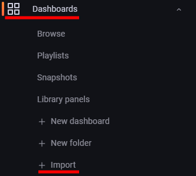

# Grafana Integration

Icinga for Windows provides default dashboards for Grafana, allowing an easy overview of the current performance metric and integration with Icinga Web.

## Requirements

To use Icinga for Windows Grafana Dashboards, you require the following components:

* InfluxDB 2
* Grafana 9.x (or later)
* [Icinga Web Grafana Module](https://github.com/Mikesch-mp/icingaweb2-module-grafana)
* [Icinga InfluxDB 2 Writer Feature enabled](https://icinga.com/docs/icinga-2/latest/doc/09-object-types/#influxdb2writer)

## Installation

### Install Icinga Web Module

By default, you have to install the [Icinga Web Grafana Module](https://github.com/Mikesch-mp/icingaweb2-module-grafana) into

```
/usr/share/icingaweb2/modules/
```
on your Icinga Web server.

Once installed, you can enable the module with the `icingacli`

```
icingacli module enable grafana
```

### Configure Module

In case you already have the [Icinga Web Grafana Module](https://github.com/Mikesch-mp/icingaweb2-module-grafana) installed and configured, you can skip this section!

You can either edit the configuration for the module within Icinga Web or edit the `config.ini` at `/etc/icingaweb2/modules/grafana/`

```
[grafana]
host = "grafana.example.com:3000"
protocol = "https"
timerangeAll = "1w/w"
defaultdashboarduid = "QsPVl5W4z"
defaultdashboardpanelid = "1"
shadows = "0"
theme = "dark"
datasource = "<influxdb source>"
accessmode = "iframe"
debug = "0"
defaultdashboard = "windows-plugins-web"
defaultorgid = "1"
ssl_verifypeer = "0"
ssl_verifyhost = "0"
custvardisable = ""
timerange = "3h"
```

Please update the fields `host`, `datasource` and possibly `custvardisable` accordingly. The `defaultdashboarduid` with value `QsPVl5W4z` is the Icinga for Windows Base-Template, while the `defaultdashboard` with `windows-plugins-web` is the name.

### Install Icinga for Windows Graphs

Each Icinga for Windows plugin repository, contains a `config` folder in which a `grafana` folder is present with `dashboards` and `icingaweb2-grafana` graphs.

To ensure the [Icinga Web Grafana Module](https://github.com/Mikesch-mp/icingaweb2-module-grafana) is using the correct Grafana dashboards for the Icinga for Windows plugins, you can copy the content of the `graphs.ini` within the plugin repositories (`config/grafana/icingaweb2-grafana/`) into the Grafana Module `graphs.ini`.

The default location is

```
/etc/icingaweb2/modules/grafana/graphs.ini
```

### Install Grafana Dashboards

Each plugin repository ships with a bunch of `.json` files, containing the configuration for the Grafana dashboards. These are located inside `config/grafana/dashboards/`.

To `Import` these dashboards, you simply have to navigate to `Dashboards` -> `Import` inside Grafana



On the section `Import via panel json`, copy the content of the `.json` file you wish to import. Repeat this process for each single file. There is currently no option to import multiple files at onces.

### Update Dashboard Configuration

Last but not least, we require to update each Grafana dashboard to properly use your `InfluxDB 2` `Bucket` for the monitoring data collected by `Icinga`.

To do so, open the dashboard you want to `edit` and hit the settings icon  on the top right of the window.

Now on the left side, click on `Variables` and search for the variable `influxbucket` on the right side. Click on the table entry with the name `influxbucket` and modify the `Constant options` `Value` with the name of the `InfluxDB 2` `Bucket`, your `Icinga` is writing monitoring metrics into.

### Overview

Once all above steps are successfully completed, you can have a look on your Grafana dashboards


