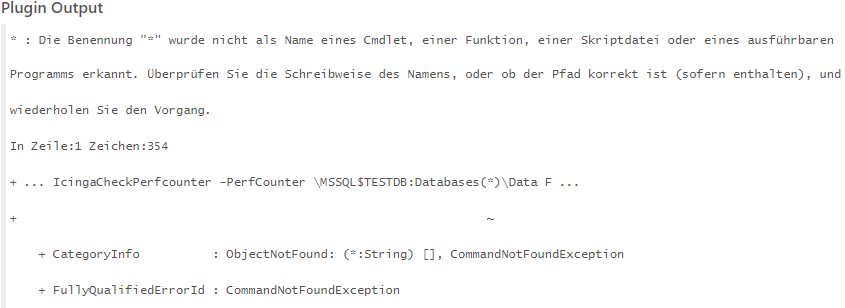
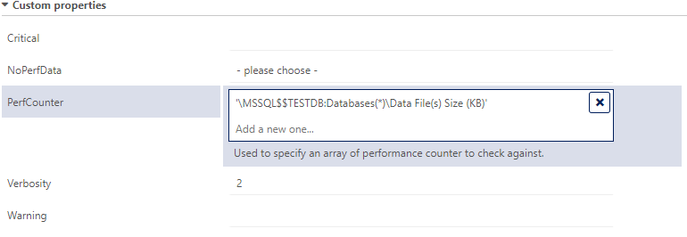
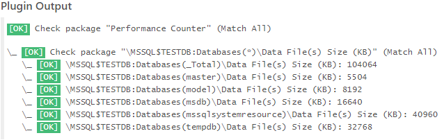

# Icinga Knowledge Base - IWKB000002

## Short Message

Plugin execution fails because arguments could not be validated and properly set. An example error could be `The "*" was not recognized as the name of a program, cmdlet, function, script file, or executable. Check the spelling of the name and that the path is correct (if included), and repeat the process.`

## Example Exception

## Reason

This error can happen if array arguments either contain special characters, like `*` or spaces. By using the configuration provided by Icinga for Windows, array arguments are taken from your configuration and re-rendered using Icinga DSL as PowerShell arrays.

In addition Icinga is not ensuring string values with included spaces are properly escaped.

## Solution

To fix this you can simply put the input values, regardless if you are within an array element of a string, into single quotes `'`. This will ensure multi-part strings are always rendered as one element during plugin execution.

**Example:**

Once the Performance Counter is put between single quotes `'`, we can view the proper check result output:

