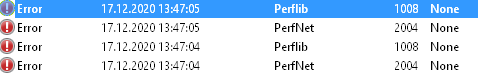

# Icinga Knowledge Base - IWKB000008

## Short Message

The EventLog contains many `Perflib`, `PerfNet` and `PerfProc` errors/warnings with EventId `1008`, `2002` and `2004`

## Example Exception

## Reason

We are using an internal .NET Class to create Performance Counter objects, as this allows us to use the english naming for `Processor` for example, instead of many different localization for categories or counter names.

By doing so, we ensure that Icinga for Windows can be used on any Windows machine, regardless of language settings.

The issue on this method is, that even while we only load the `Processor` Performance Category for example, the method will try to initialise all Performance Counter categories available on the system. Regular users, including the `NetworkService`, do not have enough permissions to access the `WmiApRpl` for example, resulting in aboves error message. Running the plugins as `Administrator` or in `System` context is not causing issues, as the required permissions to access these objects are available.

## Solution

At the moment there is no solution available to resolve this issue. Permissions to these counters cannot be granted. Disabling these Performance Counter endpoints is not suitable as well, because it might break different applications and it is also **not** adviced to run the Icinga Agent or checks in `LocalSystem` context for security reasons.

Right now a workaround would be the experimental feature [Forward Checks to Internal API](../110-Installation/30-API-Check-Forwarder.md), which is not yet ready for production.

As Performance Counter libraries are loaded during startup, they will only occur once you start the Icinga for Windows service with this daemon. Every single check executed afterwards will use Performance Counter libraries, but the current shell session has already loaded required components and therefor only access objects we want.

As a result, no additional errors or warnings are added to the EventLog.
