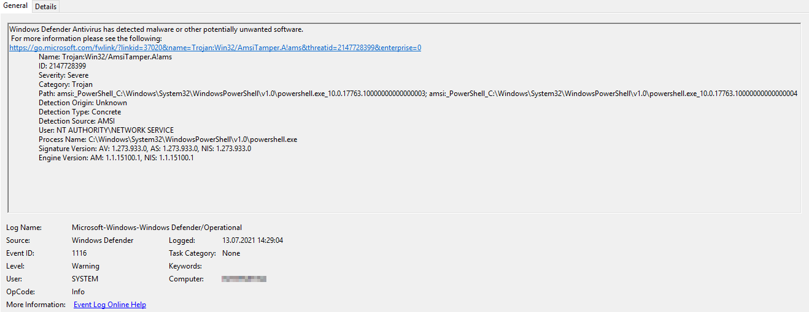

# Icinga Knowledge Base - IWKB000012

## Short Message

Icinga for Windows cannot be used with Microsoft Defender: `Windows Defender Antivirus has detected malware or other potentially unwanted software`

## Example Exception

## Reason

Icinga for Windows is using many `Functions` and `Cmdlets` and different `Add-Type` features, to accomplish an overall monitoring of the Windows environment. In some cases it can happen, that false positives are generated, preventing the usage of Icinga for Windows.

## Solution

In case you are running into the above problem, please [open a new issue](https://github.com/Icinga/icinga-powershell-framework/issues) and provide us with as much information as possible, allowing us to verify the problem and providing a solution.

In addition, please ensure that your Microsoft Defender is up-to-date and the latest patches are installed for the detection engine.
