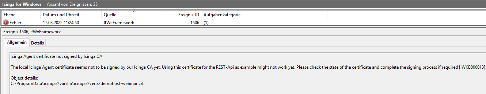

# Icinga Knowledge Base - IWKB000013

## Short Message

The local Icinga Agent certificate seems not to be signed by our Icinga CA yet. Using this certificate for the REST-Api as example might not work yet. Please check the state of the certificate and complete the signing process if required

## Example Exception

## Reason

This warning will occur, whenever Icinga for Windows is fetching the Icinga Agents local certificate, for compiling the `IcingaForWindows.pfx` certificate or by accessing the certificate for dynamically creating the REST-Api TLS certificate.

## Solution

To resolve this issue, you will have to make sure the certificate is signed by the `Icinga CA` by either manually signing the certificate on the `CA master` with `icinga2 ca sign <Fingerprint>` or by using a ticket during the setup process for signing the certificate right away.
