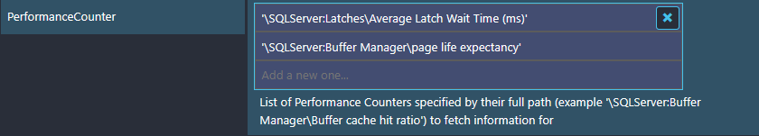
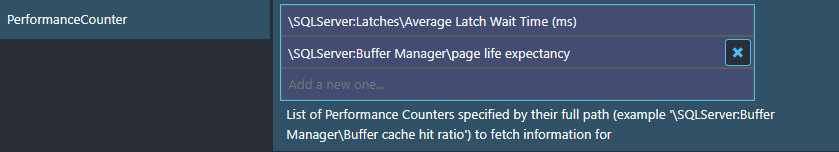

# Icinga Knowledge Base - IWKB000015

## Short Message

Got JSON, but not an object, from IfW API on host 'localhost' port '5668': "Exception while calling \\"Fill\\" with 1 argument: \\"Invalid syntax near \\"`<Argument>:`\\".\\""

## Example Exception

Got JSON, but not an object, from IfW API on host 'localhost' port '5668': "Exception while calling \\"Fill\\" with 1 arguments: \\"Invalid syntax near \\"SQLServer:`\\".\\""

## Reason

This issue is caused by using the native communication over the Icinga for Windows API with Icinga 2.14.0 or later, while using values for arguments manually escaped by the user with `''`:

## Solution

Remove all added `' '` from your Icinga configuration, regardless if you are using the Icinga Director or plain Icinga configuration files. Latest Icinga for Windows versions, will escape and build strings properly anyway, even without the new Icinga communication feature.

Once the `' '` are removed from your configuration, deploy your configuration and the check will run just fine.

