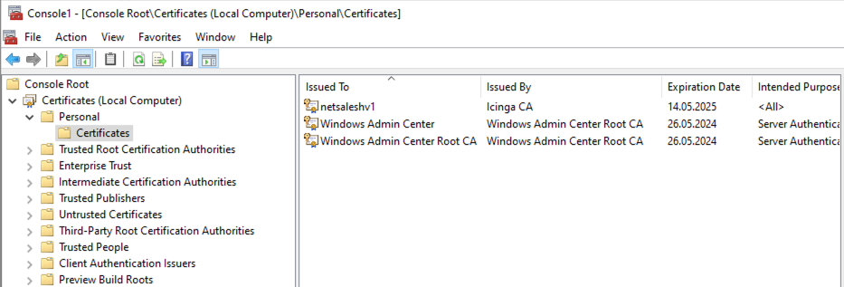
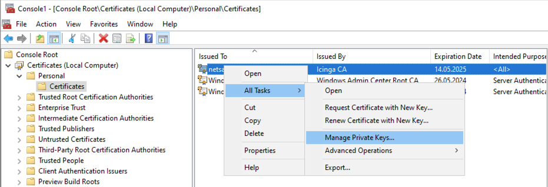
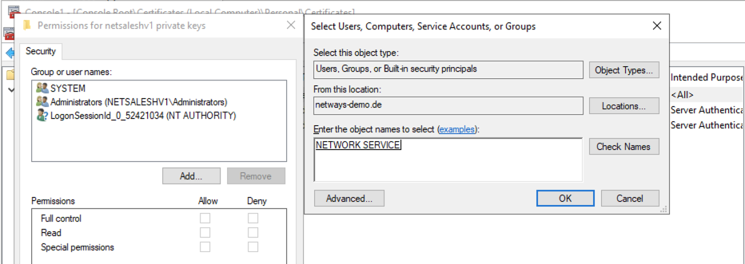
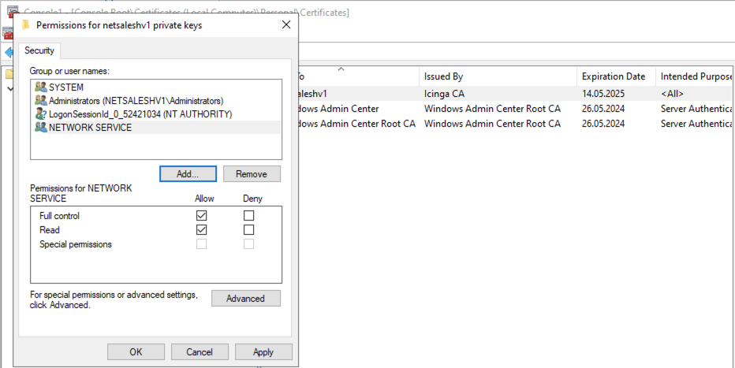

# Icinga Knowledge Base - IWKB000018

## Short Message

Icinga for Windows services throws event id 1500 with error `Exception while calling AuthenticateAsServer: The credentials supplied to the package were not recognized`

## Example Exception

Icinga for Windows throws an error with event id 1500:

```
Failed to securely establish a communication between this server and the client

A client connection could not be established to this server. This issue is mostly caused by using Self-Signed/Icinga 2 Agent certificates for the server and the client not trusting the certificate. To resolve this issue, either use trusted certificates signed by your trusted CA or setup the client to accept untrusted certificates

Icinga for Windows exception report:

Exception Message:
Exception calling "AuthenticateAsServer" with "4" argument(s): "The credentials supplied to the package were not recognized"

Command Origin:
Internal

...
```

## Reason

This message happens in case the user assigned to run Icinga for Windows has insufficient permissions to access the given certificates private key. Most commonly, this will happen when Icinga for Windows will run as `NT Authority\NetworkService` while a certificate is loaded from the certificate store.

## Solution

### Use JEA

Regardless if you are using certificates from the certificate store or the `icingaforwindows.pfx`, we recommend using [JEA-Profiles](../130-JEA/01-JEA-Profiles.md) with a dedicated user like `icinga`. This resolves most permission issues, increases security and is easier to manage.

### Use icingaforwindows.pfx

The easiest solution besides using [JEA](../130-JEA/01-JEA-Profiles.md) would to configure the Icinga for Windows background daemon to look for the default certificate to load while starting the REST-Api. This certificate is the `icingaforwindows.pfx` which is by default located at

```
C:\Program Files\WindowsPowerShell\Modules\icinga-powershell-framework\certificate\
```

This certificate is generated automatically based on your `Icinga Agent certificate` on the machine during the first installation of Icinga for Windows and updated every day at 1:00 am by a scheduled task in the background. In case the certificate is not present and you want to use it or renew the certificate, you can generate it with the following command

```powershell
Start-IcingaWindowsScheduledTaskRenewCertificate;
```

This will generate the certificate and ensure it is present on the system. If you reconfigured your API to use a specific certificate from the cert store, you can restore the default behavior with

```powershell
Register-IcingaBackgroundDaemon -Command Start-IcingaWindowsRESTApi;
```

Afterwards simply restart Icinga for Windows and the API should be working properly

```powershell
Restart-IcingaForWindows;
```

### Grant permission to user for the private key

If you want to use a certificate stored inside the certificate store and you receive the above error message, you will have to make sure the corresponding user has access to the `private key` of the certificate. By using [JEA](../130-JEA/01-JEA-Profiles.md), you can skip this part as long as it is not the `NT Authority\NetworkService` user you are having problems with.

Please make sure as well, that your certificates are stored somewhere in the `LocalMachine` store and **not** in the `CurrentUser` Space.

To change the permission for the private key of the certificate, proceed as follow

1. Hint `Windows Key + R`
2. Enter `mmc` into the Run dialog and hit enter (confirm a possible UAC prompt)
3. Inside the mmc, on the top left click on `File` -> `Add/Remove Snap-In`
4. Inside the new dialog look for `Certificates` and click the `Add` button in the middle
5. A new window `Certificates snap-in` will pop up
6. Select `Computer account` and click `Next`
7. Use the `Local computer` and click `Finish` and on the remaining Window `Ok`

Now you need to navigate to the location on where your certificate is installed to. In our example, we assume it is installed in the `Personal` space



Look for the certificate you want to modify the `private key` for and right-click the certificate.

Now navigate to `All Tasks` -> `Manage Private Keys...`



In the new window, click the `Add...` button and add the `NT Authority\NetworkService` user to the list of users having access to the private key. Most commonly you have to simply write `NETWORK SERVICE` into the prompt. Change this user for the ony applying to your use case.



Make sure to grant the user `Read` and `Full Control` permissions and click `Ok` and `Apply`



Afterwards simply restart Icinga for Windows and the API should be working properly

```powershell
Restart-IcingaForWindows;
```
